##Writeup Template
###You can use this file as a template for your writeup if you want to submit it as a markdown file, but feel free to use some other method and submit a pdf if you prefer.

---

**Vehicle Detection Project**

The goals / steps of this project are the following:

* Perform a Histogram of Oriented Gradients (HOG) feature extraction on a labeled training set of images and train a classifier Linear SVM classifier
* Optionally, you can also apply a color transform and append binned color features, as well as histograms of color, to your HOG feature vector. 
* Note: for those first two steps don't forget to normalize your features and randomize a selection for training and testing.
* Implement a sliding-window technique and use your trained classifier to search for vehicles in images.
* Run your pipeline on a video stream and create a heat map of recurring detections frame by frame to reject outliers and follow detected vehicles.
* Estimate a bounding box for vehicles detected.


## Rubric Points
###Here I will consider the [rubric](https://review.udacity.com/#!/rubrics/513/view) points individually and describe how I addressed each point in my implementation.  

---
###Writeup / README

####1. Provide a Writeup / README that includes all the rubric points and how you addressed each one.  You can submit your writeup as markdown or pdf.    

I did use the template provided in the course notes and modified it. You're reading the README.md!

###Histogram of Oriented Gradients (HOG)

####1. Explain how (and identify where in your code) you extracted HOG features from the training images.

`get_hog_features()` function was definned (lines 99 to 124 in `helperfunctions.py`) to extract the hog_features from an image. I started by reading in all the vehicle and non-vehicle images using `read_datasets()` function (lines 40 to 95 of `helperfunctions.py`). I split the dataset into training and test datasets such that all test datasets form a consequtive block to avoid cross-contamination between datasets resulting from close images that are in the datasets. In forming the datasets, I also extracted some additional iamges from the AUTTI dataset and added them to both datasets. I also added the horizontally flipped images to completment the datasets. In addition, I added some images from my own video feed.. Total vehicle and non-vehicle images that I used were 30,000, and 30,000 respectively.  Here is an example of one of each of the `vehicle` and `non-vehicle` dataset classes:

| Example Training Image - Vehicle | Example Training Image - Non-Vehicle |
|:--------------------------------:|:------------------------------------:| 
|  | 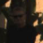 |

I then used function `extract_features()` (lines 159 to 240 of`helperfunctions.py`) to extract features such as spatial bins, color histogram features and HOG features. The parameters controlling the feature extraction characteristics (e.g. orient, pix_per_cell, cell_per_block, hog_channel, spatial_size, hist_bins, etc.) are defined as global variables and are initialized in lines 37 to 47 of `trackvehicles.py`. I randomly plotted the resulting HOG features image using various color spaces and found out that the cars are better visible in G channel, but the combined information contained in the HSV color space (i.e. all H, S and V channels combined) are more valuable in classifying the vehicle images. 

Here are examples of using the `HSV` and `RGB` color spaces and HOG parameters of `orientations=8`, `pixels_per_cell=(8, 8)` and `cells_per_block=(2, 2)`:

| Image in HSV color space | HOG feature image - H channel | HOG feature image - S channel | HOG feature image - V channel |
|:--------------:|:-----------------------------:|:-----------:|:-----------:| 
| 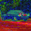 |  | 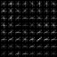 | 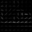 |


| Image in RGB color space | HOG feature image - R channel | HOG feature image - G channel | HOG feature image - B channel |
|:--------------:|:-----------------------------:|:-----------:|:-----------:| 
|  | 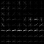 | 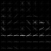 | 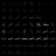 |

####2. Explain how you settled on your final choice of HOG parameters.

I plotted the resulting images on random images of vehicle and non-vehicle datasets to see visually if there is a best combination. However, after many trials, I almost did a grid search for identifying the optimium HOG parameters that resulted in the best accuracy of the trained classifier on the test dataset. The best combination consisted of using Random Forest Classifier with `orient=8`, `pix_per_cell=8`, `cell_per_block=2`, `hog_channel='HSV_ALL'`, `spatial_size=(16,16)`, `hist_bins=32`, `spatial_feat=True`, `hist_feat_RGB=True`, `hist_feat_HSV=True`, `hog_feat=True`. The accuracy on the test dataset was approximately 91% using Random Forest Classifiers.

####3. Describe how (and identify where in your code) you trained a classifier using your selected HOG features (and color features if you used them).

Function `train_classifier()` (lines 75 to 200 of `trackvehicles.py`) was used to train a classifier:    
- Initially, the features were extracted from train and test dataset images  using `extract_features()` method (lines 104 to 152 of `trackvehicles.py`). The best combination of hyper parameters (as discussed in the answer to the previous question) were passed on to the `extract_features()` function.
- Then X_scaler object was defined to normalize all the features (lines 166 to 169 of `trackvehicles.py`.
- I tried two different classifier types during the course of this project: Linear SVM Classifier, and Random Forest Classifier. For each of these classifier types, a grid search was performed to identify the optimum hyper parameters (i.e. the parameters that resulted in the highest accuracy of classification on the test dataset). It was decided that Random Forest Classifier was performing better. The classifier is defined and trained in lines 184 and 185 of `trackvehicles.py` respectively. `n_estimators=20` and `max_features=100` were found to provide near optimum results and were used during the training.


###Sliding Window Search

####1. Describe how (and identify where in your code) you implemented a sliding window search.  How did you decide what scales to search and how much to overlap windows?

I defined 4 different search areas (lines 50 to 58 of `trackvehicles.py`):
```
# search widnows below indicates the areas of interest that should be searched plus the search window size.  
# The first element is the ((x_min, x_max), (y_min, y_max)) where the coordiantes are relative to the image
# size, (i.e. between 0 and 1) and the second element is the size of the search widnow:  
search_window_0 = (np.array([[0.0,1.0], [0.5, 1.0]]), 32)
search_window_1 = (np.array([[0.0,1.0], [0.5, 1.0]]), 64)
search_window_2 = (np.array([[0.0,1.0], [0.5, 1.0]]), 96)
search_window_3 = (np.array([[0.0,1.0], [0.5, 1.0]]), 128)
all_search_windows = [search_window_0,
                      search_window_1, 
                      search_window_2,
                      search_window_3]
```
As per the above, the search window sizes vary from 32 to 128 pixels (i.e. the second element of the tuple). and the search areas are the full extent in x direction, and the lower half of the image in the y direction. I initially started by applying a perspective search (i.e. smaller area of interest for smaller window sizes, and bigger area of interest for larger window sizes), but it did not result in good performance. I also tried adding search windows of size 256, and it resulted in a lot of false positives.  
Examples of search windows drawn on example test images are shown below:

| Original Image | 32 x 32 Search Windows | 64 x 64 Search Windows | 96 x 96 Search Windows | 128 x 128 Search Windows |
|:--------------:|:----------------------:|:----------------------:|:----------------------:|:------------------------:|
|  | 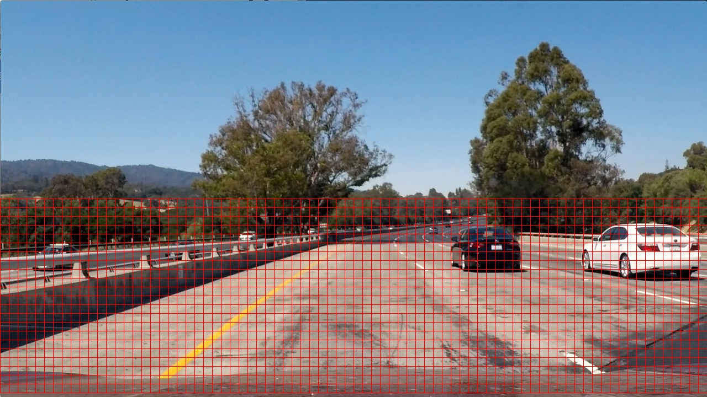 | 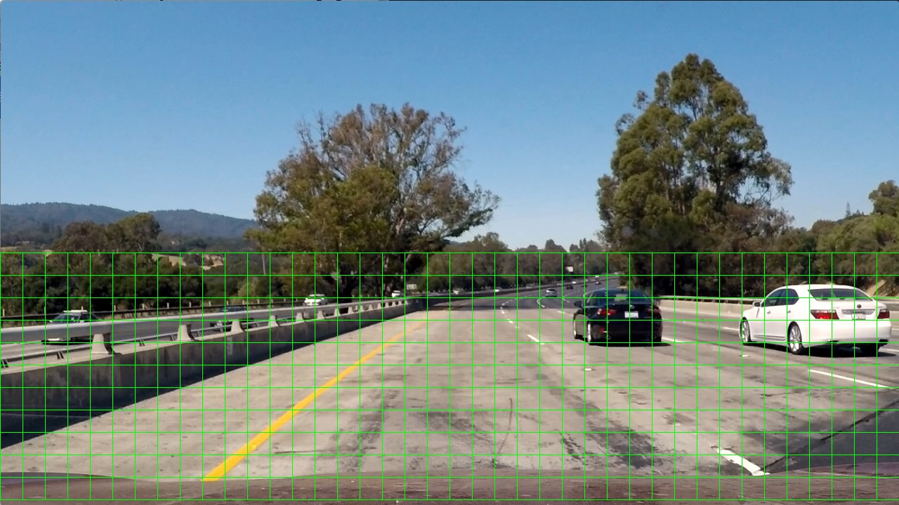 | 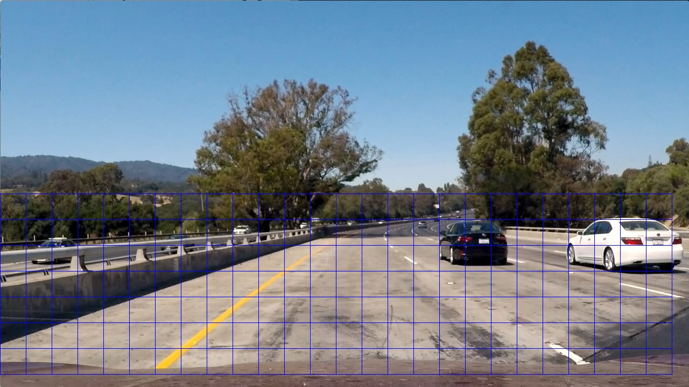 | 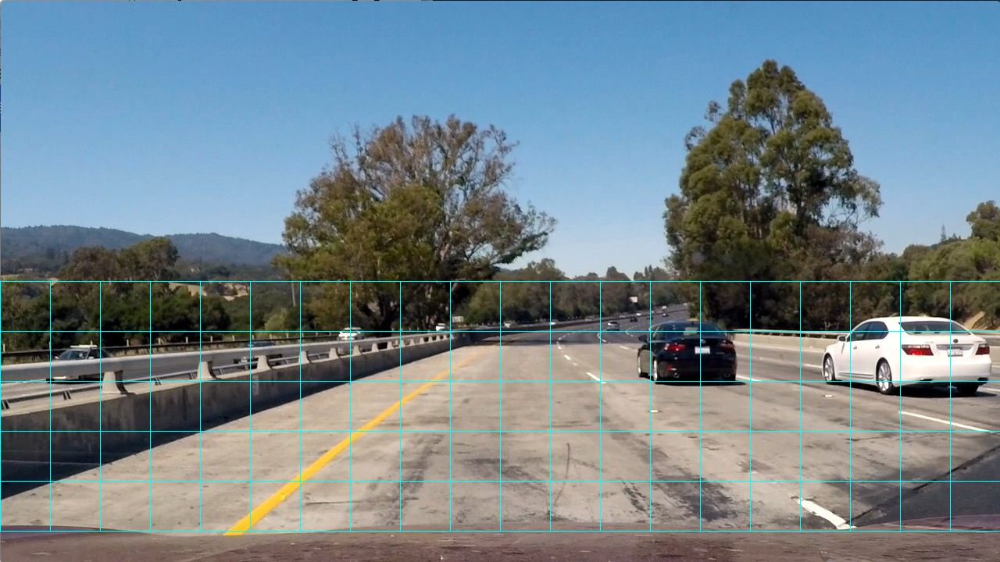 |


####2. Show some examples of test images to demonstrate how your pipeline is working.  What did you do to try to minimize false positives and reliably detect cars?

Ultimately I searched on two scales using YCrCb 3-channel HOG features plus spatially binned color and histograms of color in the feature vector, which provided a nice result.  Here are some example images:

![alt text][image4]
---

### Video Implementation

####1. Provide a link to your final video output.  Your pipeline should perform reasonably well on the entire project video (somewhat wobbly or unstable bounding boxes are ok as long as you are identifying the vehicles most of the time with minimal false positives.)
Here's a [link to my video result](./project_video.mp4)


####2. Describe how (and identify where in your code) you implemented some kind of filter for false positives and some method for combining overlapping bounding boxes.

I recorded the positions of positive detections in each frame of the video.  From the positive detections I created a heatmap and then thresholded that map to identify vehicle positions.  I then used blob detection in Sci-kit Image (Determinant of a Hessian [`skimage.feature.blob_doh()`](http://scikit-image.org/docs/dev/auto_examples/plot_blob.html) worked best for me) to identify individual blobs in the heatmap and then determined the extent of each blob using [`skimage.morphology.watershed()`](http://scikit-image.org/docs/dev/auto_examples/plot_watershed.html). I then assumed each blob corresponded to a vehicle.  I constructed bounding boxes to cover the area of each blob detected.  

Here's an example result showing the heatmap and bounding boxes overlaid on a frame of video:

![alt text][image5]

---

###Discussion

####1. Briefly discuss any problems / issues you faced in your implementation of this project.  Where will your pipeline likely fail?  What could you do to make it more robust?

Here I'll talk about the approach I took, what techniques I used, what worked and why, where the pipeline might fail and how I might improve it if I were going to pursue this project further.  

