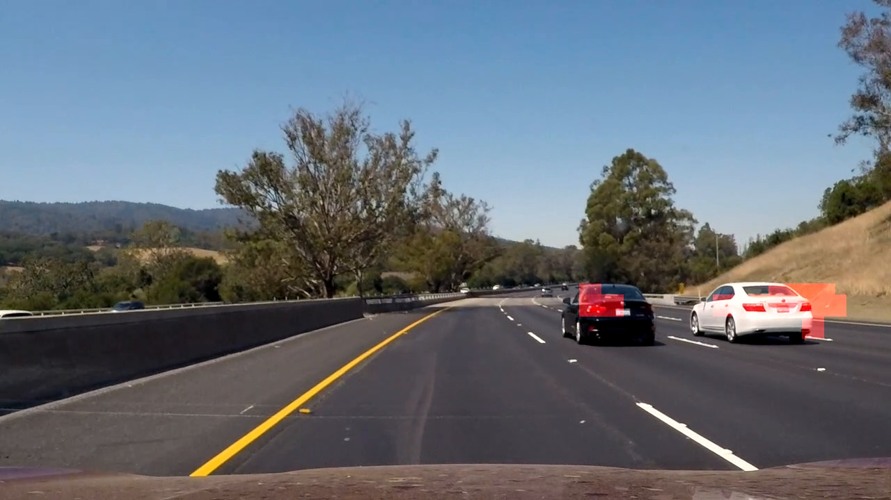

##Car-ND-Vehicle-Detection-and-Tracking

---

**Vehicle Detection and Tracking Project**

The goals / steps of this project are the following:

* Perform a Histogram of Oriented Gradients (HOG) feature extraction on a labeled training set of images and train a Linear SVM classifier.
* Optionally, you can also apply a color transform and append binned color features, as well as histograms of color, to your HOG feature vector. 
* Note: for those first two steps don't forget to normalize your features and randomize a selection for training and testing.
* Implement a sliding-window technique and use your trained classifier to search for vehicles in images.
* Run your pipeline on a video stream and create a heat map of recurring detections frame by frame to reject outliers and follow detected vehicles.
* Estimate a bounding box for vehicles detected.


## Rubric Points
###Here I will consider the [rubric](https://review.udacity.com/#!/rubrics/513/view) points individually and describe how I addressed each point in my implementation.  

---
###Writeup / README

####1. Provide a Writeup / README that includes all the rubric points and how you addressed each one.  You can submit your writeup as markdown or pdf.    

I did use the template provided in the course notes and modified it. You're reading the README.md!

###Histogram of Oriented Gradients (HOG)

####1. Explain how (and identify where in your code) you extracted HOG features from the training images.

`read_data_and_train_classifier()` (defined in lines 519 to 548 in `trackvehicles.py`) reads the training images and trains a classifier. The following pipeline is used:  
- I started by reading in all the vehicle and non-vehicle images using `read_datasets()` function (defined in lines 41 to 118 of `helperfunctions.py`). The datasets are split into training and test datasets such that all images in test datasets form a consecutive block to avoid cross-contamination between training and test datasets (note this may occur due to the close/consecutive images in the datasets that are extracted from a video stream.). In forming the datasets, additional images were extracted from the AUTTI dataset and were added to both vehicle and non-vehicle datasets.  I also added the horizontally flipped images to complement the datasets. The total number of vehicle and non-vehicle images included in the datasets were 60,000, and 60,000 respectively. About 20% of the images were set aside for testing the classifier and the rest were used for training the classifier (line 71 of `helperfunctions.py`). Below are a few examples of the `vehicle` and `non-vehicle` dataset classes:  

| Example Training Image - Vehicle | Example Training Image - Non-Vehicle |
|:--------------------------------:|:------------------------------------:| 
|  |  |

- `extract_features_from_datasets()` is then called (defined in lines 83 to 161 in `trackvehicles.py`), which in turn calls:
  - `extract_features()` (defined in lines 183 to 247 in `helperfunctions.py`). This function was used to extract all the features for training and test datasets that correspond to both vehicles and non-vehicles. Features such as spatial bins, color histogram features and HOG features were extracted. The parameters controlling the feature extraction characteristics (e.g. orient, pix_per_cell, cell_per_block, hog_channel, spatial_size, hist_bins, etc.) are defined as global variables and are initialized in lines 41 to 51 of `trackvehicles.py`. This function calls:  
    - `color_hist()` (defined in lines 165 to 179 of `helperfunctions.py`) to extract color histogram features;  
    - `bin_spatial()` (defined in lines 153 to 161 of `helperfunctions.py`) to extract spatial features; and  
    - `get_hog_features()` (defined in lines 123 to 149 of `helperfunctions.py`) to extract the hog features.    
 
I randomly plotted the resulting HOG features images using various color spaces and found out that the vehicles are reasonably better visible/identifiable in YCrCb color space. The first 2 channels provide the most information that is required for classifying the vehicles/non-vehicles.

Here are examples of the resulting hog-images using `YCrCb`, `HSV` and `RGB` color spaces and HOG parameters of `orientations=14`, `pixels_per_cell=(16, 16)` and `cells_per_block=(3, 3)`:


YCrCb Color Space:  

| Original vehicle image and HOG feature images obtained from channels 0, 1 and 2 of YCrCb color space respectively | Original non_vehicle image and HOG feature images obtained from channels 0, 1 and 2 of YCrCb color space respectively |
|:---------------------------------------------------------------------------------------------------------:|:---------------------------------------------------------------------------------------------------------:| 
|  |  |

  
HSV Color Space:  

| Original vehicle image and HOG feature images obtained from channels 0, 1 and 2 of HSV color space respectively | Original non_vehicle image and HOG feature images obtained from channels 0, 1 and 2 of HSV color space respectively |
|:---------------------------------------------------------------------------------------------------------:|:---------------------------------------------------------------------------------------------------------:| 
|  |  |

  
RGB Color Space:  

| Original vehicle image and HOG feature images obtained from channels 0, 1 and 2 of RGB color space respectively | Original non_vehicle image and HOG feature images obtained from channels 0, 1 and 2 of RGB color space respectively |
|:---------------------------------------------------------------------------------------------------------:|:---------------------------------------------------------------------------------------------------------:| 
|  |  |


Although 16x16 pixels per cell appear to be coarse, in practice it results in good classification of vehicles vs. non-vehicles and also resulted in faster training due to the lower number of features. Furthermore, chanigng the `pixels_per_cell` to 8 did not improve the accuracy of the classifier over test datasets (i.e. 86% accuracy for 16 pixels per cell and 82% accuracy for 8 pixels per cell).


####2. Explain how you settled on your final choice of HOG parameters.

I plotted the resulting images on random images of vehicle and non-vehicle datasets to see visually if there is a best combination. However, after many trials, I almost did a manual grid search for identifying the optimum HOG parameters that resulted in the best accuracy of the trained classifier on the test dataset (i.e. changing one parameter at a time and comparing the results). The best combination consisted of using Linear SVC Classifier with the following parameters:  
```
color_space = 'BGR'          # color space of the images
orient = 14                  # HOG orientations
pix_per_cell = 16            # HOG pixels per cell
cell_per_block = 3           # HOG cells per block
target_color_space='YCrCb'   # target color space
hog_channel = [0,1]          # Channels to extract hog from
spatial_size = (8, 8)        # Spatial binning dimensions
hist_bins = 16               # Number of histogram bins
spatial_feat = True          # Spatial features on or off
hist_feat = True             # Histogram features on or off
hog_feat = True              # HOG features on or off   
```
The accuracy on the test dataset was approximately 86% using the above parameters. I also used a Random Forest Classifier, but the training time and running time was too much and it did not result in significant improvement in learning/training.

####3. Describe how (and identify where in your code) you trained a classifier using your selected HOG features (and color features if you used them).

Function `train_classifier()` (defined in lines 166 to 223 of `trackvehicles.py`) was used to train a classifier:    
- Initially, the features were extracted from train and test dataset images using `extract_features()` method (lines 183 to 247 of `trackvehicles.py`). The best combination of hyper parameters (as discussed in the answer to the previous question) were passed on to the `extract_features()` function.
- Then X_scaler object was defined to normalize all the features (lines 193 to 196 of `trackvehicles.py`).
- I tried two different classifier types during the course of this project: Linear SVM Classifier, and Random Forest Classifier. For each of these classifier types, a manual grid search was performed to identify the optimum hyper parameters (i.e. the parameters that resulted in the highest accuracy of classification on the test dataset). It was decided that the Linear SVC Classifier was performing better with respect to both speed and accuracy of the test dataset. The classifier is defined and trained in lines 214 and 215 of `trackvehicles.py`. 


###Sliding Window Search

####1. Describe how (and identify where in your code) you implemented a sliding window search.  How did you decide what scales to search and how much to overlap windows?

I defined 4 different search areas (lines 55 to 64 of `trackvehicles.py`):
```
# search windows below indicates the areas of interest that should be searched plus the search window size.  
# The first element is the ((x_min, x_max), (y_min, y_max)) where the coordinates are relative to the image
# size, (i.e. between 0 and 1) and the second element is the size of the search window:  
search_window_1 = (np.array([[0.0,1.0], [0.5, 1.0]]), 64)
search_window_2 = (np.array([[0.0,1.0], [0.5, 1.0]]), 96)
search_window_3 = (np.array([[0.0,1.0], [0.5, 1.0]]), 128)
all_search_windows = [search_window_1, 
                      search_window_2,
                      search_window_3]
```
As per the above, the search window sizes vary from 64 to 128 pixels (i.e. the second element of the tuple). and the search areas are the full extent in x direction, and the lower half of the image in the y direction. I initially started by applying a perspective search (i.e. smaller area of interest for smaller window sizes, and bigger area of interest for larger window sizes), but it did not result in much performance improvement. I also tried adding search windows of size 32; while it improved the search results, it took longer time to process the images and videos, and I stopped using it.  
Examples of search windows drawn on example test images with 50% overlap are shown below:

| Description    | Image      | Description    | Image      |
|:--------------:|:----------:|:--------------:|:----------:|
| Original Image |  | 64 x 64 Search Windows |  |
| 96 x 96 Search Windows |  | 128 x 128 Search Windows |  |


####2. Show some examples of test images to demonstrate how your pipeline is working.  What did you do to try to minimize false positives and reliably detect cars?

Function `mark_vehicles_on_frame()` (defined in lines 332 to 452 or `trackvehicles.py`) implements the pipeline that draws bounding boxes on the images. The following steps are performed in this function:  
1- The function iterates through all_search_windows containing tuple elements, with the first element of the tuple identifying the area of interest, and the second item identifying the size of the search window (lines 354 to 371 of `trackvehicles.py`). For each search_window:  
  - function `slide_window()` is called to obtain the list of search windows with 50% overlap. `slide_window()` is defined in lines 251 to 293 of `helperfunctions.py`.  
  - function `search_windows()` (lines 251 to 293 of `helperfunctions.py`) is then called to assess the classifier on each search window identified in the previous step and determine if the subject search_window is a vehicle or not. This function internally calls `extract_hog_features_once()` (lines 297 to 355 of `helperfunctions.py`) if hog_batch is True in order to extract HOG features only once for the region of interest and to speed up the process (i.e. instead of extracting HOG features for each search window). if hog_batch is not True, then HOG features are extracted for each search_window image, which takes longer.    
2- The list of hot windows (i.e. windows that contained car segments) is then appended to a list that stores the hot windows for the past few frames. Information pertaining to the 10 most recent frames are stored in `recent_hot_windows` (i.e. `num_frames_to_keep = 10`). (lines 362 to 371 of `trackvehicles.py`)  
3- A `heatmap` object is created, which has the same dimensions as the image that is being processed by adding 1 inside the hot windows for all recent frames that are stored in `recent_hot_windows` (lines 384 to 387 of `trackvehicles.py`).  
4- Two threshold values are used to screen the false positives and only return non-zero values where the value is above the thresholds (lines 399 to 402 of `trackvehicles.py`). The high threshold is later on used identify peaks (i.e. cars), and then the low threshold is used to identify the extent of each object. The thresholded heat maps (i.e. `heatmap_high`, and `heatmap_low`) along with the original image are then passed to function `draw_bboxes_using_watershed()`, which estimate the location of the cars.   
5- `draw_bboxes_using_watershed()` (defined in lines 228 to 282 of `trackvehicles.py`) uses the `watershed()` method function from `skimage.morphology` library as well as `label()` from `scipy.ndimage.measurements` and `distance()` function from `scipy.ndimage` library to identify the zones that are connected together in the heat map.  I also implemented another implementation of this function called `draw_bboxes_using_label()` which only uses one threshold value and the `label()` function, and is simpler - defined in lines 286 to 316 of `trackvehicles.py`.   


The above pipeline is shown consecutively in the example images below:

| Description    | Image      |
|:--------------:|:----------:|
| Original Image |  |
| Image with hot windows drawn (Step 1 above) |  |
| Image with heat map drawn (Step 3 above) |  |
| Image with high thresholded heat map drawn (Step 4 above) |  |
| Image with low thresholded heat map drawn (Step 4 above) |  |
| Applying the distance function to the high thresholded heat map (Step 5 above) |  |
| Applying the distance function to the low thresholded heat map (Step 5 above) |  |
| Identify car blobs using label function (Step 5 above) |  |
| Processed image with bounding boxes drawn on it (Step 5 above) |  |

---

### Video Implementation

####1. Provide a link to your final video output.  Your pipeline should perform reasonably well on the entire project video (somewhat wobbly or unstable bounding boxes are ok as long as you are identifying the vehicles most of the time with minimal false positives.)  

Here's a [link to my video result](./Processed_project_video.mp4)


####2. Describe how (and identify where in your code) you implemented some kind of filter for false positives and some method for combining overlapping bounding boxes.

The following pipeline is used:  
- I recorded the positions of positive detections in each frame of the video and stored them in `recent_hot_windows` (defined globally in line 36 of `trackvehicles.py`).  
- From the positive detections I created a `heatmap` object and then thresholded it to identify vehicle positions (using 2 thresholds as explained above: the high threshold for identifying the vehicle positions and low threshold to identify the extent of each vehicle).  
- I then used  `draw_bboxes_using_watershed()` (defined in lines 228 to 282 of `trackvehicles.py`), which uses the `watershed()` method function from `skimage.morphology` library as well as `label()` from `scipy.ndimage.measurements` and `distance()` function from `scipy.ndimage` library to identify the zones that are connected together in the `heatmap`.  
- Using the `watershed()` function allows for overlapping bounding boxes. However, I used a rather large window size of 144 by 144 for searching local maxima on the result of the `distance` function (line 250 of `trackvechicles.py`). This resulted in smoother bounding boxes in the video stream but came at the expense of putting one bounding box over two vehicles if they are too close or overlapping.  
- After each car area is detected, then the maximum and minimum x and y of each labeled area (which was determined by using `label()` function - line 276 of `trackvehicles.py`) is used to determine the bounding box and to draw it on the image (line 279 of `trackvehicles.py`)

The pipeline images presented above shows the operation inside the `draw_bboxes_using_watershed()` function in a graphical way.

---

###Discussion

####1. Briefly discuss any problems / issues you faced in your implementation of this project.  Where will your pipeline likely fail?  What could you do to make it more robust?

The following challenges were faced during this problem:  
1- The dark car color in the video stream initially posed a challenge because the dark colors associated with shadows, etc. were initially associated with non-vehicles class. However, after switching the color space to YCrCb color space and adding additional training images, this obstacle was overcome.  
2- Initially the white car could not be identified when slightly far away from the source camera (also see below). However, with changing the window search sizes, and thresholding/averaging over 10 frames it finally worked.
3- The thresholding and averaging of hot_windows over multiple frames can be further optimized by using better algorithms.

The following situations may result in the failure of the pipeline:  
1- When lighting conditions change (i.e. shadows on the road, and or change in the color of the asphalt), the classifier may identify many false positives, which is not good. The threshold values can be adjusted to resolve this, but this results in dynamically changing the threshold values to account for the lighting conditions.
2- Given the search window sizes that I used and the thresholding operation, the smaller cars (i.e. the cars on the other side of the road, or he cars that are very far) cannot be detected. Perhaps a separate search can be done and dedicated in identifying the smaller cars, but this will result in a time-consuming operation which may not be warranted for a live feed video.


The following can be done to make the program mor robust:
1- Come up with better classifiers. Use deep learning techniques.
2- Use better and more training exmaples (i.e. in different light conditions, etc.).
3- Use images that only show parts of a car in the training dataset (note that is what I did with the AUTTI dataset inclusion).
4- Use a better algorithm to detect overlapping cars.
5- Track the position and size of each car through the recent frames. That way one can smooth out the trackign windows and avoid flickering changes in the bounding boxes. Also False negatives can be avoided to some extnet using thsi technique.
